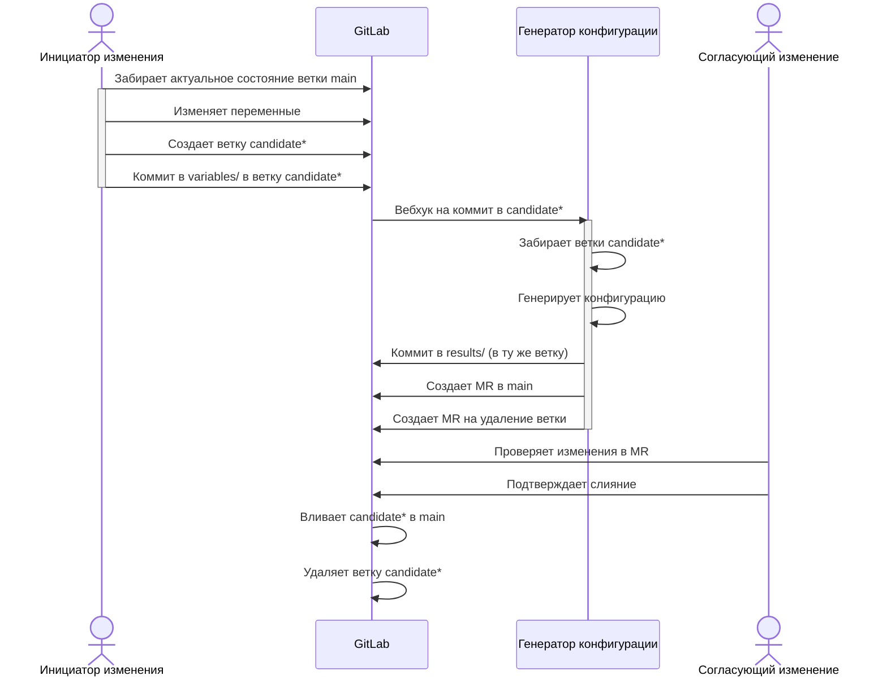
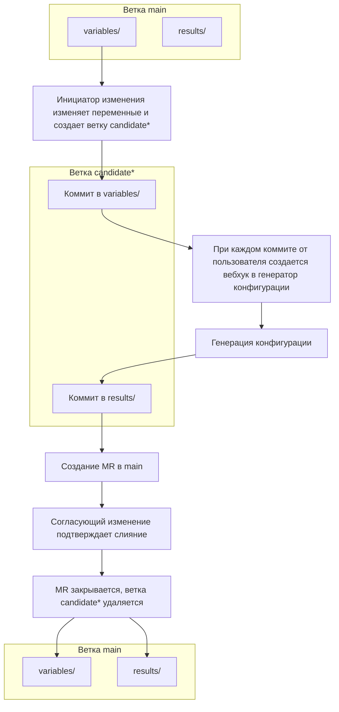

# config_templates

## Sequence Diagram

```mermaid
sequenceDiagram
    actor U as Инициатор изменения
    participant G as GitLab
    participant C as Генератор конфигурации
    actor A as Согласующий изменение


    U->>G: Забирает актуальное состояние ветки main
    activate U
    U->>G: Изменяет переменные
    U->>G: Создает ветку candidate*
    U->>G: Коммит в variables/ в ветку candidate*

    deactivate U
    
    G->>C: Вебхук на коммит в candidate*
    activate C
    
    C->>C: Забирает ветки candidate*
    C->>C: Генерирует конфигурацию
    C->>G: Коммит в results/ (в ту же ветку)
    C->>G: Создает MR в main
    C->>G: Создает MR на удаление ветки
    
    deactivate C
    
    A->>G: Проверяет изменения в MR
    A->>G: Подтверждает слияние
    G->>G: Вливает candidate* в main
    G->>G: Удаляет ветку candidate*
```

## Процесс

```mermaid
graph TD
    subgraph "Ветка main"
        K[variables/]
        L[results/]
    end
    K --> A
    A[Инициатор изменения изменяет переменные и создает ветку candidate*] --> B[Коммит в variables/]
    B --> C[При каждом коммите от пользователя создается вебхук в генератор конфигурации]
    C --> D[Генерация конфигурации]
    D --> E[Коммит в results/]
    E --> F[Создание MR в main]
    F --> G[Согласующий изменение подтверждает слияние]
    G --> H[MR закрывается, ветка candidate* удаляется]
    
    subgraph "Ветка candidate*"
        B
        E
    end
    
    subgraph "Ветка main"
        I[variables/]
        J[results/]
    end
    
    H --> I
    H --> J
```