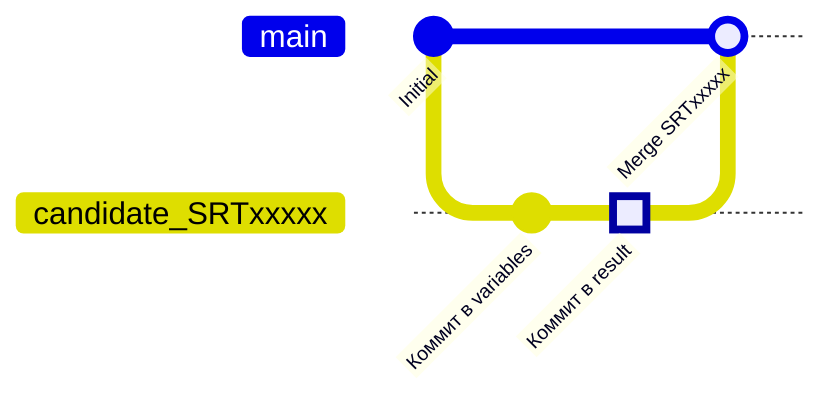
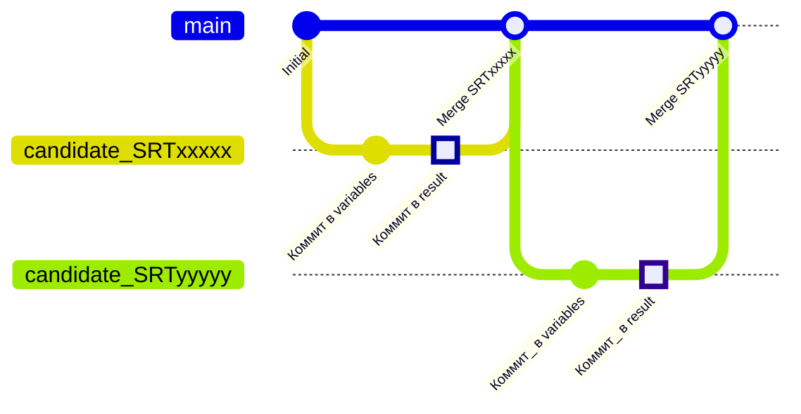
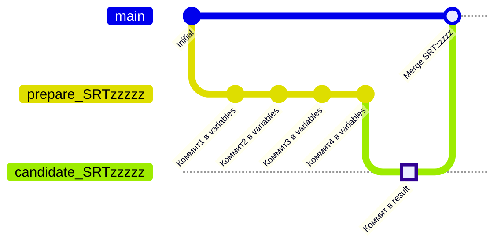
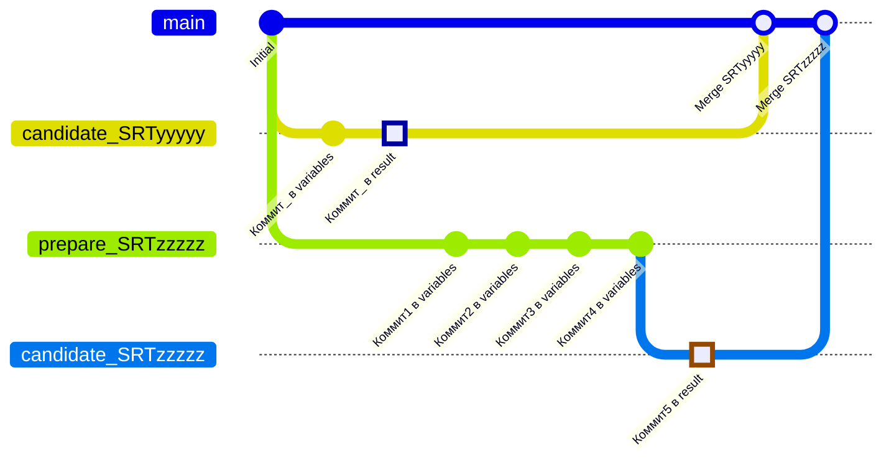
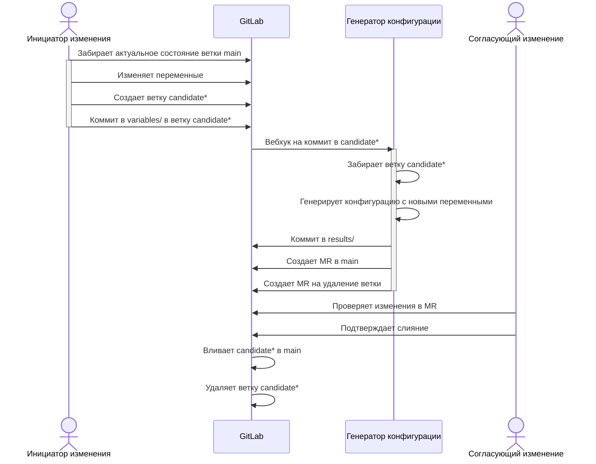
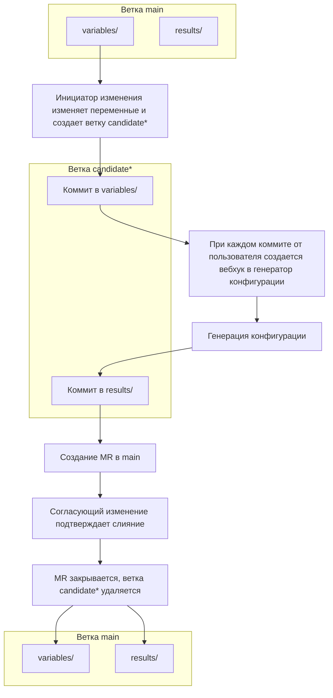

# config_templates
В gitlab в ветке main хранятся переменные (variables) и сгенерированные скриптом конфигурации (results)

В main запрещены прямые коммиты, только через MR.\
При изменении переменных пользователь создает новую ветку "candidate*" и при коммите в нее создается вебхук в сторону внешнего генератора конфигурации. \
Генератор конфигурации использует шаблоны jinja2 и создает конфигурации с новыми переменными. Результат сохраняет в директорию results. Затем делает коммит в ту же ветку и создает MR в main с удалением исходной ветки. Согласующий подтверждает слияние. 

**Плюсы**

- Автоматизация — генерация конфигурации без ручного вмешательства

- Консистентность — переменные и конфигурации всегда синхронизированы

- Review — согласование сгенерированных конфигураций перед публикацией (вливанием в main)

- Безопасность — запрет прямых коммитов в main защищает от случайных изменений

- Полная история изменений переменных и конфигураций.

- Ветвление — параллельная работа над изменениями разных переменных

- Идемпотентность — генератор конфигурации создает MR только если есть изменения в конфиге (например, игнорируются изменения readme)

- Автоочистка репозитория — автоматическое удаление веток после мерджа

**Минусы**

- При изменении шаблона jinja2 требуется вручную запустить генератор конфигурации и провести Review

- Хранение исходных данных (переменных) и производных (конфигураций) в одном репозитории

- Возможны конфликты нескольких "долгоиграющих" изменений

## GIT graph
### Одно изменение

### Последовательные изменения

### Предварительная подготовка переменных без генерации конфига

### Параллельная работа над переменными

## Sequence Diagram

## Процесс

